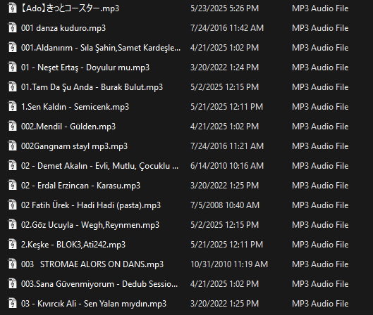
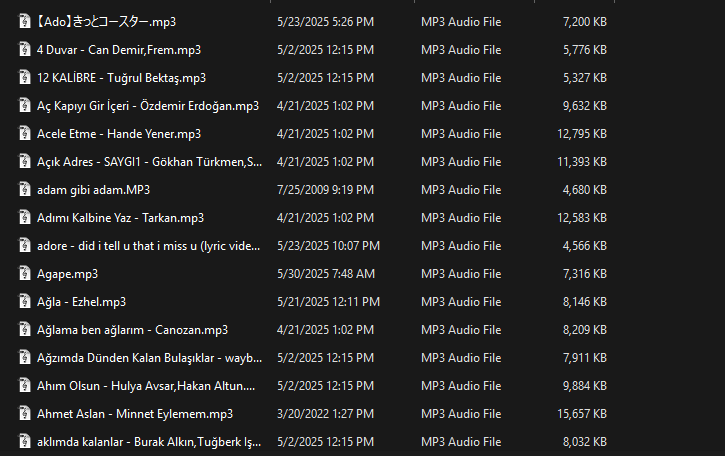
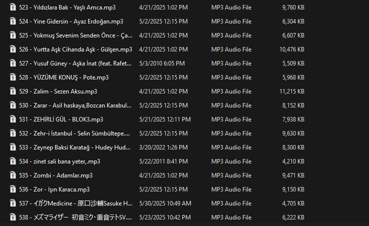

# mp3 başına numara koyma ve numara silme

> **⚠️ Uyarı:** Bu araç sadece `.mp3` uzantılı dosyalarda çalışır!

Merhaba! Bu projeyi, babam uzun yola çıkarsak şarjınız boşa gitmesin al bu usb'yi at bütün müzikleri dedi. Dediğini yaptım yapmasına da babam azar çekti uzun bir bana müzikleri numaralandırmamı istedi baktım hem babamın eski müziklerde hem de toplu mp3 indirme sitelerinden aldığım müziklerde numara var bunları silmek gerek dedim çok üşendim hem silip hem tekrar 0'dan numaralandırmaya sonra bunu araştırırken insanların cidden böyle bir şeye ihtiyacı olduğunu fark ettim ondan dolayı ben bunu kodlayıp github atayım dedim herkes kolayca kullanabilsin diye de direkt js kullandım kurulumu ve kullannımı çok kolay normal kullanıcı için. Neyse yeterince boş yaptım alın nasıl çalıştığı ve kurulduğu:

1. **silici**: Mevcut başındaki numaraları siler.
2. **koyucu**: Yeniden sıfırdan artan numaralar ekler.

## Gereksinimler

- [Node.js](https://nodejs.org/) (LTS önerilir)
- Git (opsiyonel, klonlamak için direkt indiredebilirsiniz)

## Kurulum

```
git clone https://github.com/EspeeeBne/mp3basinanumarakoymavesilme.git
cd mp3basinanumarakoymavesilme
npm install
````

## Kullanım

### 1. Numara Silme (`npm run silici`)

Önceden numaralı dosya isimleri şu tarzdır bende öyle en azından:



```
npm run silici
```

Ardından, silmek istediğiniz klasör veya dizin yolunu yazın ve `Enter` tuşuna basın. İşlem tamamlandığında şöyle görünür:



### 2. Yeniden Numaralandırma (`npm run koyucu`)

Tüm dosyaları baştan artan şekilde numaralandırmak için:

```
npm run koyucu
```

Klasör veya dizin yolunu girdikten sonra `Enter` tuşuna basın. İşlem tamamlandığında şöyle görünür:



---

Hepsi bu kadar! Artık müzikleriniz düzenli ve istediğiniz sırada sıralanmış olacak.
